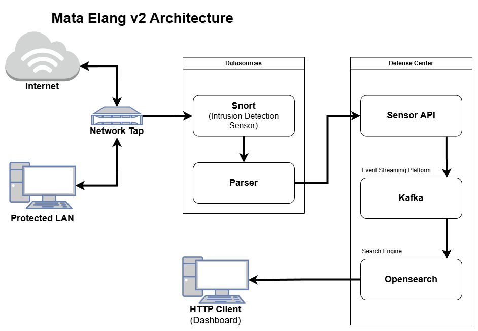

# Installation Guide ‐ Mata Elang V.2

## Overview

Snort is a well-known, signature-based network intrusion detection system (NIDS). The Snort sensor must be placed within the same physical network, and the defense centers in the typical NIDS architecture offer limited network coverage, especially for remote networks with a restricted bandwidth and network policy. Additionally, the growing number of sensor instances, followed by a quick increase in log data volume, has caused the present system to face big data challenges. This research paper proposes a novel design for a cloud-based Snort NIDS using containers and implementing big data in the defense center to overcome these problems. Our design consists of Docker as the sensor’s platform, Apache Kafka as the distributed messaging system, and big data technology orchestrated on lambda architecture. We conducted experiments to measure sensor deployment, optimum message delivery from the sensors to the defense center, aggregation speed, and efficiency in the data-processing performance of the defense center. We successfully developed a cloud-based Snort NIDS and found the optimum method for message delivery from the sensor to the defense center. We also succeeded in developing the dashboard and attack maps to display the attack statistics and visualize the attacks. Our first design is reported to implement the big data architecture, namely, lambda architecture, as the defense center and utilize rapid deployment of Snort NIDS using Docker technology as the network security monitoring platform.

Mata Elang is the evolution of the Mata Garuda Internet Monitoring Project for Indonesia. This project was initialized as a private repository in 2018 by LabJarkomC307 - Politeknik Elektronika Negeri Surabaya. Currently, Mata Elang is a collaboration research between PENS, Universitas Indonesia, and BRIN (Badan Riset dan Inovasi Nasional). Mata Elang is supported by JICA.

This project is based on the article :
Saputra, F.A.; Salman, M.; Hasim, J.A.N.; Nadhori, I.U.; Ramli, K. The Next-Generation NIDS Platform: Cloud-Based Snort NIDS Using Containers and Big Data. Big Data Cogn. Comput. 2022, 6, 19. https://doi.org/10.3390/bdcc6010019

## Installation

This section discuss about how to install Mata Elang Platform.

## Installation and Configuration

- [System Requirement](System-Requirement)
- [Defense Center Installation](Installation-and-Configuration/{Defense-Center-Installation})
- [Sensor Installation](Installation-and-Configuration/{Sensor-Installation})

## Operation and Maintenance

- [Startup/Shutdown Procedures](Startup-and-Shutdown-Procedures)
- User Management
  - [OpenSearch User Management](User-Management-(OpenSearch))
- Sensor Management
  - [Update Sensor Rule](Updating-Sensor-Rule)
- [Troubleshooting](Troubleshooting)

## Add-ons

- Integration with OpenCTI
  - [OpenCTI Installation](OpenCTI-Installation)
  - [OpenCTI Connector Configuration](OpenCTI-Connector-Configuration)
- [Report Generator](Report-Generator-Configuration-and-Installation)

## User Manual
- [OpenDashboard Usage Manual](OpenSearch-Dashboard-Manual-Page)
- [Report Generator Usage Manual](User-Management-(Report-Generator))