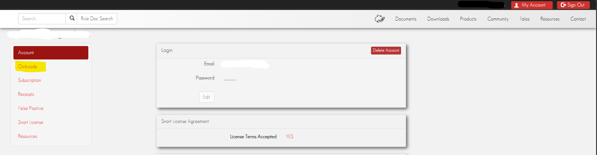
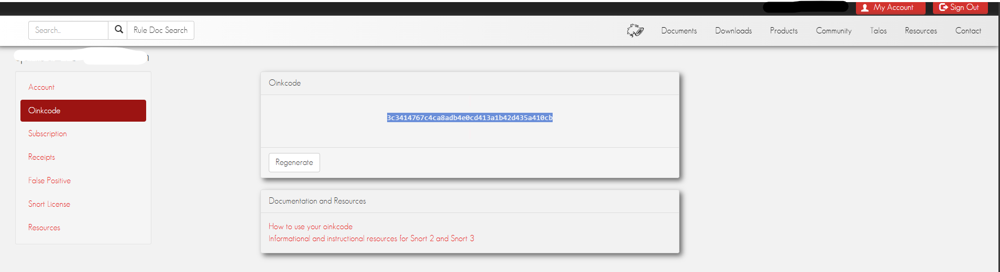

## Open Sensor Enviroment

```bash
cd docs/sensor_snort
nano .env
```

You will see two sections, **Mata Elang: Sensor Snort** and **Mata Elang: Sensor Parser.** For this purpose, you just need to change between **Mata Elang: Sensor Snort** section.

## Sensor Rule Configuration

### Network Interface

```bash
### Default value ###
NETWORK_INTERFACE=eth0
```

You may change it's value to suit your sensor's network interface.

:key: **NOTE:** To check your network interface, use this command:

```bash
ip a
```

### Snort Oinkcode

```bash
### Default value ###
SNORT_OINKCODE=
```

Snort Oinkcode is required if you want to use registered and lightspeed rules.

###### :key: Obtaining Snort Oinkcode

To earn your own oinkcode, you must register to [Snort Sign In](https://snort.org/users/sign_up). Create new account if you don't have one.

After you logged in, go to **Oinkcode** tab on the side bar, and you can see your personal Snort Oinkcode.




Insert that Oinkcode into `SNORT_OINKCODE` value if needed.

### Updating Ruleset

```bash
### Default value ###
RULESET=community
```

There are multiple ways to set sensor ruleset, using Community Rules `community` and Registered Rules `registered`, and LightSPD Rules `lightspd`

:key: comunity, registered, and lightspd.

- `community` refer to all rules that have been submitted by members of the open source community or Snort Integrators.

- `registered` refer to a rule that is part of the ruleset available to users who have registered on the Snort website, providing them access to a set of security rules that are updated regularly, but with a slight delay compared to the more comprehensive "subscriber" ruleset which is available to paying subscribers.

- `lightspd` refers to a rule within the "LightSPD" rules package designed for Snort 3, a network intrusion detection and prevention system, allowing users to configure specific detection policies with tailored configurations for optimal performance based on their network needs.

### Snort Compressed Rules File Path

```bash
### Default value ###
SNORT_COMPRESSED_RULES_FILE_PATH=
```

You may uncomment and specify an absolute path inside the container to install or update rules from a file. **For example**:

```bash
SNORT_COMPRESSED_RULES_FILE_PATH=/tmp/rules/filename.tar.gz
```

This setting allows you to manage your Snort rules more efficiently by sourcing them from a compressed file.

### IPS Policy Configuration

```bash
### Default value ###
IPS_POLICY=balanced
```
You may change the IPS policy to suit your network's security needs. Possible values include:

- **connectivity**: Prioritizes network performance over security.
- **balanced**: Balances network performance and security.
- **security**: Prioritizes security over network performance.
- **max-detect**: Maximizes detection capabilities, potentially impacting performance.
- **none**: Disables the IPS policy.

Uncomment and modify the `IPS_POLICY` line to set your preferred policy.

### Blocklist Configuration

```bash
### Default value ###
SNORT_BLOCKLIST=false
ET_BLOCKLIST=false
BLOCKLIST_URLS=
```
You may uncomment and configure the blocklist settings to enhance your network security.

- **SNORT_BLOCKLIST**: Set to `true` to enable Snort's blocklist.
- **ET_BLOCKLIST**: Set to `true` to enable Emerging Threats' blocklist.
- **BLOCKLIST_URLS**: Specify URLs from which to fetch blocklist data. Ensure these URLs are correctly formatted and accessible.

Uncomment and modify the lines as needed to activate and customize blocklist functionality.
