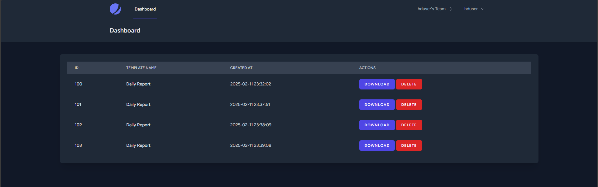

Here is how you could generate Mata Elang v2 Statistic Report.

## First, Access Mata Elang Report Generator's Site
Open your browser and go to [Mata Elang Report Generator](https://report.mataelang.net/dashboard)

## Insert Your Defense Center's Credential

You need to insert your account credential to proceed.

## Choosing The Report You Want to Save

At your Mata Elang Report Generator Dashboard, you can download and save the report as PDF file. You can find each report's template name, and it's date of creation.