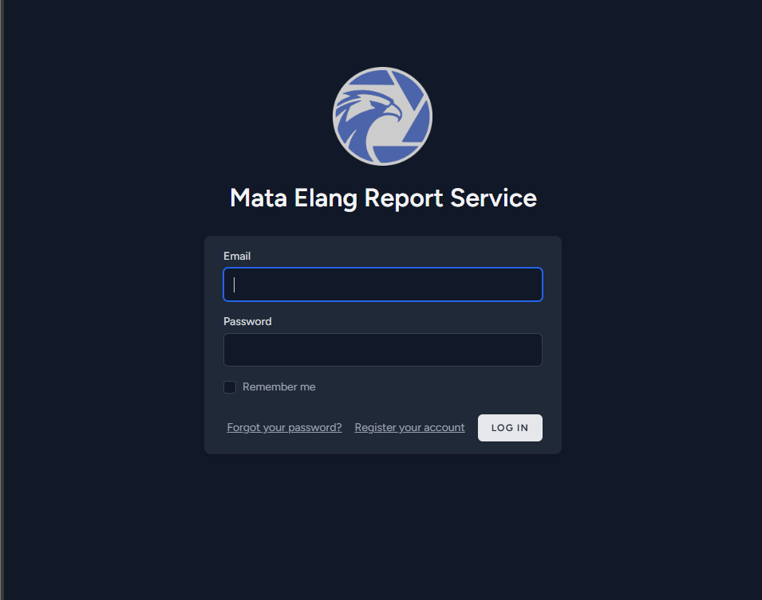

## Prerequisite

:white_check_mark: Defense Center installed.
[Defense Center Installation](../../Installation-and-Configuration/Defense-Center-Installation.md).

## Configurating and Installing Report Generator

▶️ All files about Report Generator are inside **defense Center** folder. Access through it and open **.env**.

```bash
cd docs/defense_center
la .env*
```

:key: .env default variable values:

```bash
POSTGRES_DB=mataelang
POSTGRES_USER=mataelang
POSTGRES_PASSWORD=mataelang@123

OPENSEARCH_INITIAL_ADMIN_PASSWORD=mataelang@123
```

You may change its value to suit your database configuration.

### Installing Report Generator Service

▶️ After you done configurating **.env**, pull the report generator image.

```bash
cd docs/defense_center
docker compose -f compose.reporting.yml pull
```

Wait until pull process is done.

▶️ After pulling process is done, you can start the services by following this command.

```bash
docker compose -f compose.reporting.yml up -d
```

▶️ Check the container whether it's already running or not.

```bash
docker compose -f compose.yml ps -a
```

🔑 You shall expect this kind of result.

```bash
NAME                                 IMAGE                                                                COMMAND                  SERVICE                        CREATED      STATUS                          PORTS
mataelang-chromium-1                 zenika/alpine-chrome                                                 "chromium-browser --…"   chromium                       5 days ago   Up 5 days
mataelang-iplookup-api-1             ghcr.io/mata-elang-stable/iplookup-api:latest                        "/app/main"              iplookup-api                   5 days ago   Up 5 days                       3000/tcp
mataelang-pgsql-1                    postgres:17                                                          "docker-entrypoint.s…"   pgsql                          5 days ago   Up 5 days                       5432/tcp
mataelang-redis-1                    valkey/valkey:8                                                      "docker-entrypoint.s…"   redis                          5 days ago   Up 5 days                       6379/tcp
mataelang-report-api-1               ghcr.io/mata-elang-stable/report-api-service:latest                  "/var/www/html/start…"   report-api                     5 days ago   Up 5 days                       9000/tcp
mataelang-report-command-service-1   ghcr.io/mata-elang-stable/report-command-service:latest              "/go/bin/app"            report-command-service         5 days ago   Up 5 days
```

## Checking Your Report Generator Service

▶️ Open your browser and insert **https://[YOUR_IP_ADDRESS]:8085**

:key: You shall expect to see Report Generator Login Page.


