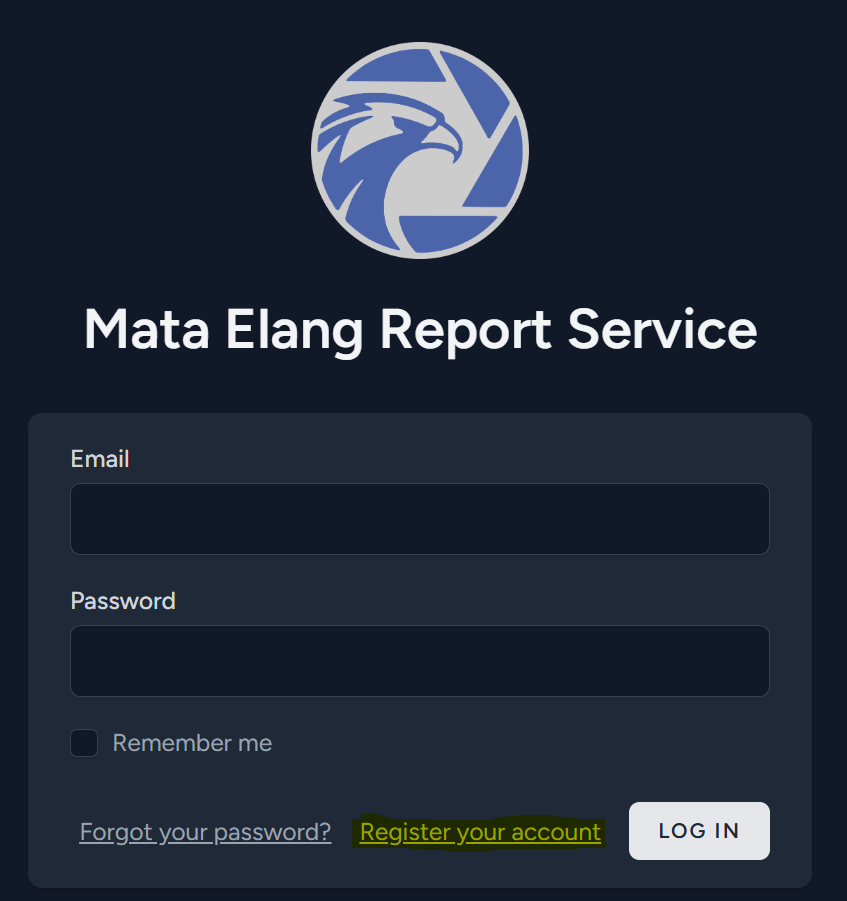

Here is how you create a report from Mata Elang v2 using Mata Elang Report Generator.

## Access your report generator service on browser using https://YOUR_IP_ADDRESS:8085.

>**NOTE:** If you haven't registered yet, you have to create new account by clicking **Register your account**
>
>
>
>
>After that, go back to **Login Page** and use your new account as your credential to log into report generator.

## Search for the report you want to download.

>- To generate latest report, you can click **Generate Report** button. This action will create a new report and you can check the latest report by checking the **Created At** column.
>- You can download your report by clicking **Download** button.
>- Also, you can delete that report by clicking **Delete** button.

Your downloaded file will be stored on your browser's download path.

